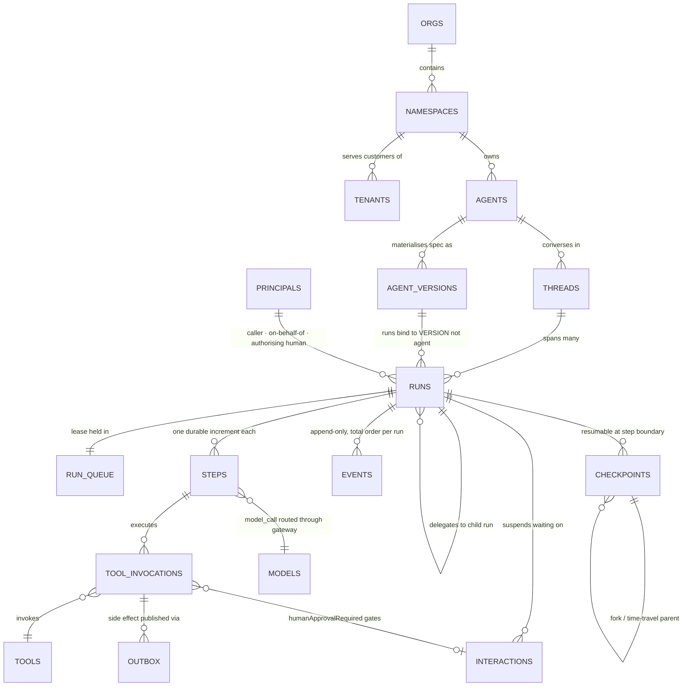
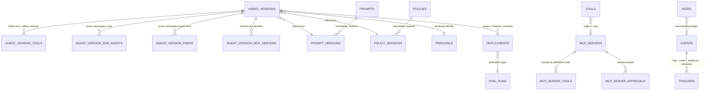
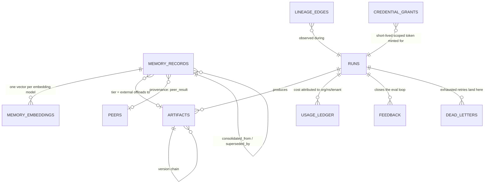

# Schema relationships

Companion to `db/schema.sql`. Section refs (§) point at `pwd.md`.
54 tables in four groups: control plane, execution, state/data, quality.

## Core execution spine

## Control plane

## State, memory and lineage

`lineage_edges` is deliberately a generic `(derived_kind, derived_id) -> (source_kind, source_id)`
edge table rather than a set of typed FKs. It has to link runs, steps, tool invocations, memory
records, artifacts, interactions and peer results interchangeably so §15.3's traversal —
*answer ← memory ← MCP result ← artifact ← user input* — is one recursive query, not a join per
hop. The cost is no referential integrity on the endpoints; the `lineage_node_kind` enum plus the
`UNIQUE` on the whole edge is what keeps it honest.

## Relationships that carry weight

| Relationship | Cardinality | Why it is shaped this way |
|---|---|---|
| `threads` → `runs` | 1:N | §3. Workspace, artifacts and memory hang off the thread; retries, checkpoints and leases hang off the run. Conflating them loses resumability across turns. |
| `runs` → `agent_versions` | N:1 | A run binds to an immutable version, never to `agents`. A promotion mid-flight must not change what an in-flight run is executing. |
| `runs` → `runs` (`parent_run_id`, `root_run_id`) | 1:N, self | §4.6. Child runs survive parent crashes, so the child is a first-class row, not an embedded field. `root_run_id` makes "everything under this originating request" one index scan; `delegation_depth` is capped by CHECK so cycle/depth limits are engine-enforced, not conventional. |
| `runs` ↔ `run_queue` | 1:0..1 | §4.4. Leases and heartbeats are the hottest writes in the system. Splitting them off `runs` keeps a 40-column row from being rewritten every few seconds, and gives the claim query a narrow partial index. |
| `agent_versions` → `agent_version_sub_agents` → `agents` | via `(id, namespace_id)` | §13.3. The composite FK means a cross-namespace sub-agent is *unrepresentable*, not merely rejected in application code. Cross-namespace coordination has to go through `agent_version_peers`. Verified by probe 2. |
| `agent_version_tools` | N:M + contract | §8.3. The effect array lives on the *binding*, not the tool, because the same tool can be `read_only` for one agent and gated behind `human_approval_required` for another. The CHECK constraints make "never cache side-effecting operations" and "compensatable needs a named inverse" structural. |
| `tool_invocations` → `interactions` | N:0..1 | §14. A `human_approval_required` effect creates the Interaction *before* execution; the FK is what lets an audit answer "who approved this refund" without a log search. |
| `interactions` → `runs` twice (`run_id`, `originating_run_id`) | N:1 each | §14.3. Multi-hop delegation: the interaction is *raised* by the deepest run and *answered* by whoever sits at the top of the chain. One FK cannot express both ends. |
| `events` → `runs` | N:1, partitioned | §0.2/§15.1. `schema_version` on every row; `seq` gives total order per run, which is simultaneously the SSE `Last-Event-ID` cursor (§12.1) and the A2A stream ordering guarantee (§13.4). One event store, no second one for A2A. |
| `memory_records` scope columns | 6 nullable FKs + CHECK | §6.2. Scope is an enum with exactly one matching reference column, enforced by a `CASE` CHECK. A single polymorphic `scope_ref uuid` would have lost cascade-delete: closing a thread should take its thread-scoped memory with it. |
| `artifacts.content_hash` | UNIQUE per org | §11.2. Content-addressed dedup, scoped to the org so one tenant's bytes can never resolve into another's artifact. |
| `capability_grants` | two sources | §16.2. `spec ∩ service grant ∩ user grant`. Service and user grants share a table but are distinguished by `grant_source`, so the intersection is one query. Absence of a user grant is a rejection — there is no fallback row to find. |

## Partitioning and retention

`events`, `usage_ledger` and `audit_log` are `PARTITION BY RANGE (occurred_at)` with monthly
partitions. Retention is `DETACH` + `DROP` of the oldest partition, never a mass `DELETE`.

One tradeoff worth stating plainly: Postgres requires the partition key in the primary key, so
`events` is keyed `(run_id, seq, occurred_at)` and the index alone does not enforce `(run_id, seq)`
uniqueness across partitions. What actually enforces it is sequence allocation — writers take the
run's row lock with `UPDATE runs SET last_event_seq = last_event_seq + 1 ... RETURNING` inside the
same transaction as the event insert. That serialises allocation per run and delivers the total
per-run ordering §4.5 promises. The alternative (`PARTITION BY HASH (run_id)`) would give the
stronger key but makes time-based retention a per-partition delete instead of a drop.

Before dropping an `events` partition, export it to the replay corpus CI runs against on every
change to the event model (§0.2) — a change that breaks replay of archived logs is a breaking
change.

## What is deliberately not here

- **No cache tables.** A cache hit and a cache miss must produce identical replayable history, so
  caches never touch the event log (§10). Caching lives in Redis/provider-native, outside this schema.
- **No A2A task table, no MCP session table.** Task maps to `runs`, `contextId` to `threads`,
  `input-required` to `interactions`. The MCP transport is stateless as of the 2026-07-28 revision;
  there is no session lifecycle to persist (§13.1, §20).
- **No business-state tables.** Agent-produced business data is an `artifact` — a proposal and audit
  trail — that the consuming service commits to its own canonical store (§3.1).
- **No blobs.** Large content is an artifact reference; Postgres holds metadata, hash and URI (§11.2).

## Verification

Applied clean against PostgreSQL 13 (pgvector shimmed locally). 54 tables, 126 indexes, 38 CHECK
constraints. Thirteen invariant probes ran as inserts against a live database — cross-namespace
sub-agent, cacheable non-idempotent tool, compensatable without an inverse, unbounded queue policy,
empty MCP allowlist, root run with nonzero delegation depth, agent-scoped memory without an agent,
external-tier memory without an artifact, terminal run without `ended_at`, lease owner without
expiry — all rejected by the database; the two valid cases inserted.

Target for a real deployment is PostgreSQL 16+ with pgvector ≥ 0.5 (the `hnsw` index needs it).
